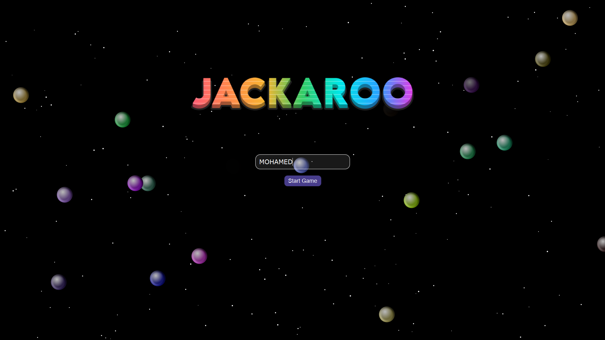
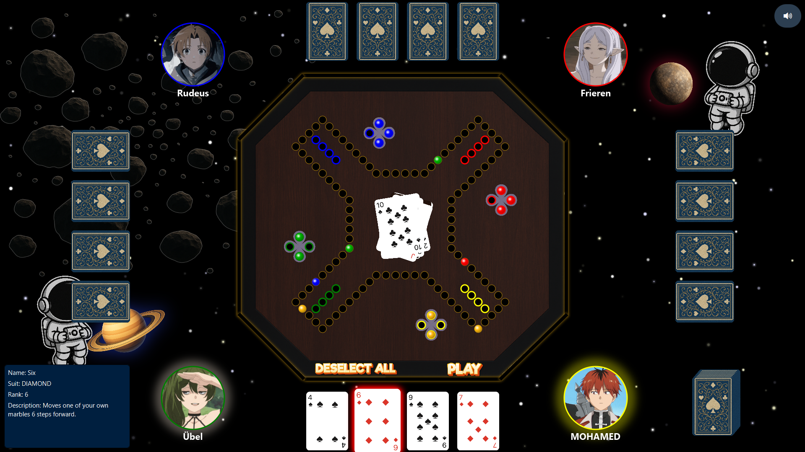

# Jackaroo Game 🎲

A JavaFX-based implementation of the **Jackaroo board game** with support for both single-player (CPU) and multiplayer modes.  
The game includes smooth marble animations, card handling (including special burner/saver cards), and an interactive UI.

---

## 🚀 Features
- 🎮 Play against friends or CPU opponents
- 🃏 Full card deck including special cards
- ⚡ Animated marble transitions
- 🎨 Modern JavaFX UI

---

## 📦 Installation

### Prerequisites
- Java 17+  
- JavaFX SDK  
- (Optional) Maven or Gradle for dependency management

### Steps
1. Clone this repository:
   ```bash
   git clone https://github.com/your-username/jackaroo.git
2. Open the project in your IDE (Eclipse, IntelliJ, or VS Code).
3. Make sure JavaFX is configured.
4. Play and enjoy the game!
---

## 🖼️ Screenshots





---

## 👨‍💻 Team & Credits

Built with 💡 and a lot of passion by a 4-member developer team:

- **Mohamed Enan** – [LinkedIn](https://www.linkedin.com/in/mohamed-enan-1122ba306/)
- **Mahmoud abohady** – [LinkedIn](https://www.linkedin.com/in/mahmoud-abohady/)
- **Ahmed Reda** – [LinkedIn](https://www.linkedin.com/in/ahmed-reda-8084442b4/)

---
